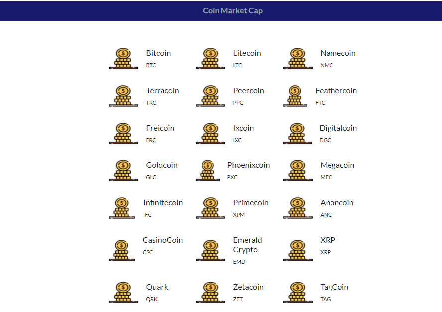

# Projeto: Requisitando dados de uma API de criptomoedas :moneybag:                

Feito através do bootcamp React Web Developer da DIO. Instruções da Bárbara Casac        

### Documentação:
* [Portal do desenvolvedor](https://pro.coinmarketcap.com/account)
* [Documentação de autenticação](https://coinmarketcap.com/api/documentation/v1/#section/Authentication)
* [Documentação da API](https://coinmarketcap.com/api/documentation/v1/#)

:bank: #Do it!
